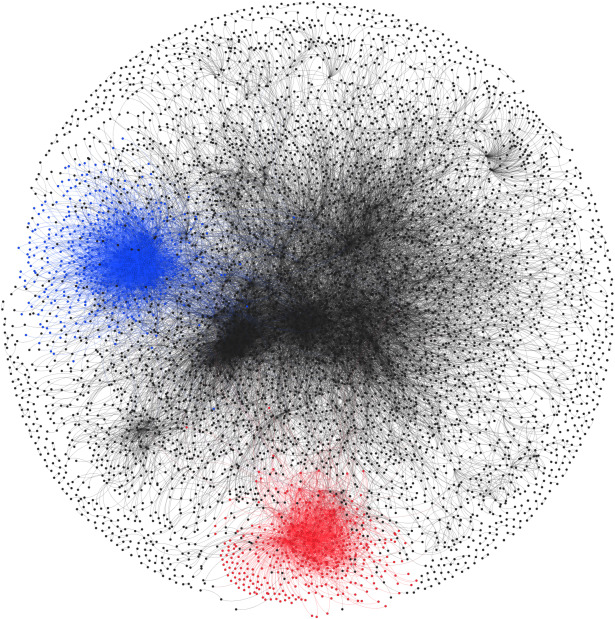

I collaborated on this research project with Dr. Yao-Tai Li and Dr. Hsuan-Wei Lee. This study focused on the unique communication patterns of health professionals on social media platforms, which are mostly based in the United States, particularly in the context of the pandemic outbreak in the first half of 2020. In this research, I employed empirical quantitative research methodologies, encompassing time series analysis, natural language processing, and social network analysis, to analyze the public conversation that was embedded in the subsequent relationship, changing across the time period. We fill the gap in the literature that mainly discusses how national and international health agencies take actions during pandemics. We use a mixed-methods approach to provide a more systematic understanding of the information shared by health professionals that aligns with their personal political attitudes.

